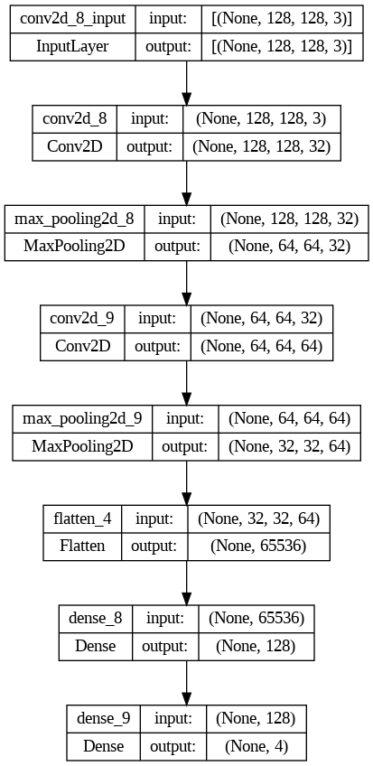
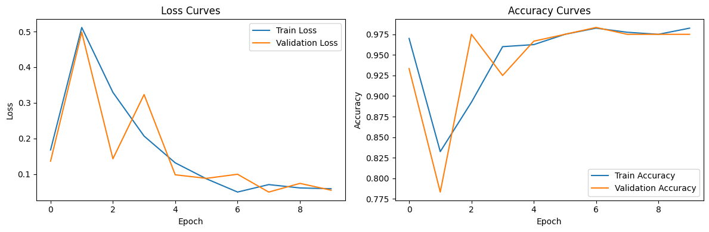
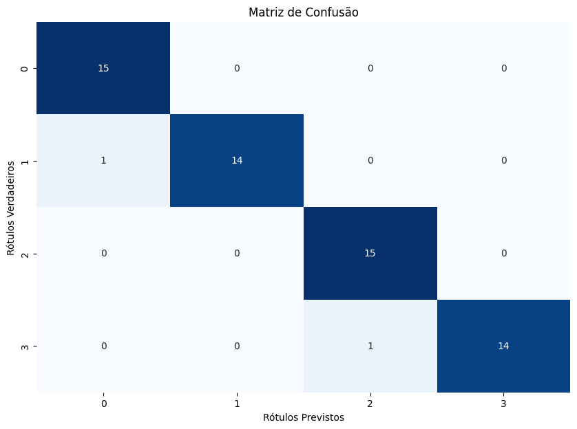
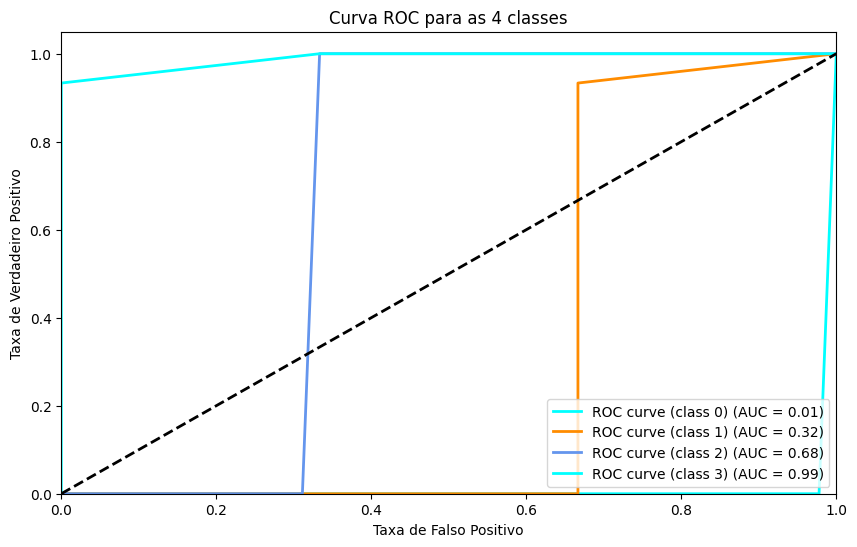
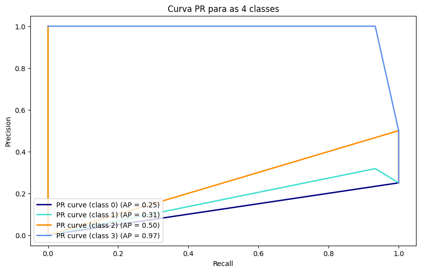

<h1>Minha X Rede Neural Convolucional para Aprendizado de Máquina</h1>
<h2>*** Classificador de quadrados, círculos, losangolos e triângulos em imagens ***</h2>
<br>
<h3>Augusto Felipe Maggioni</h3>


```python
import os
import tensorflow as tf
from keras.models import Sequential
from keras.layers import Dense
from keras.layers import Flatten
import numpy as np
from keras.layers import Conv2D, Conv3D
from keras.layers import Reshape
from keras.layers import MaxPooling2D
from keras import backend as K
from keras.preprocessing import image
from keras.preprocessing.image import ImageDataGenerator
from keras.utils import load_img, img_to_array
```


```python
from google.colab import drive
drive.mount('/content/gdrive')
```

    Mounted at /content/gdrive
    


```python
import requests, lxml, re, json, urllib.request
from bs4 import BeautifulSoup
import os, uuid
import requests

headers = {
    "User-Agent": "Mozilla/5.0 (Windows NT 10.0; Win64; x64) AppleWebKit/537.36 (KHTML, like Gecko) Chrome/103.0.5060.114 Safari/537.36"
}


def download_image(url_image, path_save):
  response = requests.get(url_image)
  if response.status_code == 200:
      with open(f'{os.path.join(PATH_IMAGES, str(uuid.uuid4()))}.jpg', 'wb') as file_img:
          file_img.write(response.content)
          print("ok")


for step in [('train', 100), ('test', 30), ('valid', 15)]:
  for name_image in ['circle', 'trapezoid', 'squares', 'triangles']:
    qnt = 0
    PATH_IMAGES = f'/content/gdrive/My Drive/Machine Learning/CNN3/{name_image}/{step[0]}'
    if not os.path.exists(PATH_IMAGES):
      os.makedirs(PATH_IMAGES)
    idx_page_search = 0
    while True:
      if qnt >= step[1]:break
      params = {
        "q": f"{name_image} format png",
        # "tbm": "isch",
        # "hl": "en",
        # "gl": "us",
        "ijn": idx_page_search,
        "sclient": "img"
      }

      res = requests.get("https://www.google.com/search", params=params, headers=headers)
      soup = BeautifulSoup(res.text, "lxml")

      for img in soup.select('img'):
        try:
          print(img['data-src'])
          if 'type=FAVICON' in img['data-src']:continue
          download_image(img['data-src'], PATH_IMAGES)
          qnt +=1
          if qnt >= step[1]:break
        except:continue
      idx_page_search += 1
```


```python
import cv2
train_images, test_images = [], []
train_labels, test_labels = [], []
valid_images, valid_labels = [], []
for idx, name_image in enumerate(['circle', 'trapezoid', 'squares', 'triangles']):
  for img_path in os.listdir(f'/content/gdrive/My Drive/Machine Learning/CNN2/{name_image}/train'):
    img = cv2.imread(os.path.join(f'/content/gdrive/My Drive/Machine Learning/CNN2/{name_image}/train', img_path))
    img = (img / 255.0).astype('float32')
    img = cv2.resize(img, (128, 128))
    #img = cv2.cvtColor(img, cv2.COLOR_BGR2GRAY)
    train_labels.append(idx)
    train_images.append(img)

  for img_path in os.listdir(f'/content/gdrive/My Drive/Machine Learning/CNN2/{name_image}/test'):
    img = cv2.imread(os.path.join(f'/content/gdrive/My Drive/Machine Learning/CNN2/{name_image}/test', img_path))
    img = (img / 255.0).astype('float32')
    img = cv2.resize(img, (128, 128))
    #img = cv2.cvtColor(img, cv2.COLOR_BGR2GRAY)
    test_labels.append(idx)
    test_images.append(img)

  for img_path in os.listdir(f'/content/gdrive/My Drive/Machine Learning/CNN2/{name_image}/valid'):
    img = cv2.imread(os.path.join(f'/content/gdrive/My Drive/Machine Learning/CNN2/{name_image}/valid', img_path))
    img = (img / 255.0).astype('float32')
    img = cv2.resize(img, (128, 128))
    #img = cv2.cvtColor(img, cv2.COLOR_BGR2GRAY)
    valid_labels.append(idx)
    valid_images.append(img)
```


```python
model = Sequential([
    Conv2D(32, (3, 3), activation='relu', input_shape=(128, 128, 3), padding='same'),
    MaxPooling2D((2, 2)),
    Conv2D(64, (3, 3), activation='relu', padding='same'),
    MaxPooling2D((2, 2)),
    Flatten(),
    Dense(128, activation='relu'),
    Dense(4, activation='softmax')
])
```


```python
model.compile(optimizer='adam',
              loss='sparse_categorical_crossentropy',
              metrics=['accuracy'])
```


```python
model.summary()
tf.keras.utils.plot_model(model, show_shapes=True)
```

    Model: "sequential_4"
    _________________________________________________________________
     Layer (type)                Output Shape              Param #   
    =================================================================
     conv2d_8 (Conv2D)           (None, 128, 128, 32)      896       
                                                                     
     max_pooling2d_8 (MaxPoolin  (None, 64, 64, 32)        0         
     g2D)                                                            
                                                                     
     conv2d_9 (Conv2D)           (None, 64, 64, 64)        18496     
                                                                     
     max_pooling2d_9 (MaxPoolin  (None, 32, 32, 64)        0         
     g2D)                                                            
                                                                     
     flatten_4 (Flatten)         (None, 65536)             0         
                                                                     
     dense_8 (Dense)             (None, 128)               8388736   
                                                                     
     dense_9 (Dense)             (None, 4)                 516       
                                                                     
    =================================================================
    Total params: 8408644 (32.08 MB)
    Trainable params: 8408644 (32.08 MB)
    Non-trainable params: 0 (0.00 Byte)
    _________________________________________________________________
    


    

    


```python
train_images_np = np.array(train_images)
train_labels_np = np.array(train_labels)
test_images_np = np.array(test_images)
test_labels_np = np.array(test_labels)
valid_images_np = np.array(valid_images)
valid_labels_np = np.array(valid_labels)
```


```python
from tensorflow.keras.callbacks import EarlyStopping, ModelCheckpoint

early_stopping = EarlyStopping(monitor='val_loss', patience=5, verbose=1, restore_best_weights=True)
model_checkpoint = ModelCheckpoint('best_model.h5', monitor='val_loss', save_best_only=True)
```


```python
history  = model.fit(train_images_np, train_labels_np, epochs=10, batch_size=8, validation_data=(test_images_np, test_labels_np),
            callbacks=[early_stopping, model_checkpoint],)
```

    Epoch 1/10
    50/50 [==============================] - 1s 22ms/step - loss: 0.1677 - accuracy: 0.9700 - val_loss: 0.1361 - val_accuracy: 0.9333
    Epoch 2/10
    50/50 [==============================] - 1s 12ms/step - loss: 0.5115 - accuracy: 0.8325 - val_loss: 0.4981 - val_accuracy: 0.7833
    Epoch 3/10
    50/50 [==============================] - 1s 14ms/step - loss: 0.3294 - accuracy: 0.8925 - val_loss: 0.1430 - val_accuracy: 0.9750
    Epoch 4/10
    50/50 [==============================] - 1s 12ms/step - loss: 0.2067 - accuracy: 0.9600 - val_loss: 0.3232 - val_accuracy: 0.9250
    Epoch 5/10
    50/50 [==============================] - 1s 12ms/step - loss: 0.1316 - accuracy: 0.9625 - val_loss: 0.0980 - val_accuracy: 0.9667
    Epoch 6/10
    50/50 [==============================] - 0s 9ms/step - loss: 0.0867 - accuracy: 0.9750 - val_loss: 0.0880 - val_accuracy: 0.9750
    Epoch 7/10
    50/50 [==============================] - 0s 9ms/step - loss: 0.0496 - accuracy: 0.9825 - val_loss: 0.0995 - val_accuracy: 0.9833
    Epoch 8/10
    50/50 [==============================] - 0s 8ms/step - loss: 0.0705 - accuracy: 0.9775 - val_loss: 0.0495 - val_accuracy: 0.9750
    Epoch 9/10
    50/50 [==============================] - 0s 9ms/step - loss: 0.0611 - accuracy: 0.9750 - val_loss: 0.0739 - val_accuracy: 0.9750
    Epoch 10/10
    50/50 [==============================] - 0s 9ms/step - loss: 0.0589 - accuracy: 0.9825 - val_loss: 0.0547 - val_accuracy: 0.9750
    


```python
import matplotlib.pyplot as plt

plt.figure(figsize=(12, 4))
plt.subplot(1, 2, 1)
plt.plot(history.history['loss'], label='Train Loss')
plt.plot(history.history['val_loss'], label='Validation Loss')
plt.legend()
plt.title('Loss Curves')
plt.xlabel('Epoch')
plt.ylabel('Loss')

plt.subplot(1, 2, 2)
plt.plot(history.history['accuracy'], label='Train Accuracy')
plt.plot(history.history['val_accuracy'], label='Validation Accuracy')
plt.legend()
plt.title('Accuracy Curves')
plt.xlabel('Epoch')
plt.ylabel('Accuracy')

plt.tight_layout()
plt.show()
```


    

    


**Análise da curva loss**

 - Fica perceptível que ao longo das épocas o a validação loss possui banstante variação, mas que ao final do treinamento a rede chega a se estabilizar e ocorrer com menor. Não distante, no próprio treinamento, no início, há uma instabilidade, chegando a aumentar a perda (em azul). Isso significa que no início do treinamento a rede estava com bastante instabilidade, não conseguindo chegar a um padrão. Por outro lado, a partir da época 5, ocorre, tanto no trainamento quando na validação uma convergência maior, apesar dos valores de perdas serem pequeno.

**Análise da curva de acurácia**
 - Assim como na curva de loss, mas de maneira inversa, observa-se que a rede, ao início, possui uma acuária alta e em seguida uma quedra brusca. Entretanto, nas próximas épocas a rede se estabiliza e acaba chegando nos maiores valores que o modelo conseguiu chegar. A partir da época 5, a rede se estabiliza tanto nos dados de treinamento quando no de validação


 Em resumo, apesar da instabilidade inicial, ao final o modelo consegue aprender e distinguir as 4 classes com eficiência de 96%. Aumentar e/ou diminuir o número de épocas e batch, ao final, a métrica de acurácia sofre pequena variação ao ponto de não ser significativa para a classificação final.


```python
test_loss, test_accuracy = model.evaluate(valid_images_np, valid_labels_np)
print(f'Acurácia no conjunto de teste: {test_accuracy}')
```

    2/2 [==============================] - 0s 11ms/step - loss: 0.1893 - accuracy: 0.9667
    Acurácia no conjunto de teste: 0.9666666388511658
    


```python
predict = model.predict(valid_images_np)
classes = np.argmax(predict, axis=1)
```

    2/2 [==============================] - 0s 7ms/step
    


```python
for ic, classe_predita in enumerate(classes):
  print(f'Classe real: {valid_labels_np[ic]}. Classe predita {classe_predita}')
  if classe_predita == valid_labels_np[ic]:
    print("acertou")
  else:
    print("errou")
```

    Classe real: 0. Classe predita 0
    acertou
    Classe real: 0. Classe predita 0
    acertou
    Classe real: 0. Classe predita 0
    acertou
    Classe real: 0. Classe predita 0
    acertou
    Classe real: 0. Classe predita 0
    acertou
    Classe real: 0. Classe predita 0
    acertou
    Classe real: 0. Classe predita 0
    acertou
    Classe real: 0. Classe predita 0
    acertou
    Classe real: 0. Classe predita 0
    acertou
    Classe real: 0. Classe predita 0
    acertou
    Classe real: 0. Classe predita 0
    acertou
    Classe real: 0. Classe predita 0
    acertou
    Classe real: 0. Classe predita 0
    acertou
    Classe real: 0. Classe predita 0
    acertou
    Classe real: 0. Classe predita 0
    acertou
    Classe real: 1. Classe predita 1
    acertou
    Classe real: 1. Classe predita 1
    acertou
    Classe real: 1. Classe predita 1
    acertou
    Classe real: 1. Classe predita 1
    acertou
    Classe real: 1. Classe predita 0
    errou
    Classe real: 1. Classe predita 1
    acertou
    Classe real: 1. Classe predita 1
    acertou
    Classe real: 1. Classe predita 1
    acertou
    Classe real: 1. Classe predita 1
    acertou
    Classe real: 1. Classe predita 1
    acertou
    Classe real: 1. Classe predita 1
    acertou
    Classe real: 1. Classe predita 1
    acertou
    Classe real: 1. Classe predita 1
    acertou
    Classe real: 1. Classe predita 1
    acertou
    Classe real: 1. Classe predita 1
    acertou
    Classe real: 2. Classe predita 2
    acertou
    Classe real: 2. Classe predita 2
    acertou
    Classe real: 2. Classe predita 2
    acertou
    Classe real: 2. Classe predita 2
    acertou
    Classe real: 2. Classe predita 2
    acertou
    Classe real: 2. Classe predita 2
    acertou
    Classe real: 2. Classe predita 2
    acertou
    Classe real: 2. Classe predita 2
    acertou
    Classe real: 2. Classe predita 2
    acertou
    Classe real: 2. Classe predita 2
    acertou
    Classe real: 2. Classe predita 2
    acertou
    Classe real: 2. Classe predita 2
    acertou
    Classe real: 2. Classe predita 2
    acertou
    Classe real: 2. Classe predita 2
    acertou
    Classe real: 2. Classe predita 2
    acertou
    Classe real: 3. Classe predita 3
    acertou
    Classe real: 3. Classe predita 3
    acertou
    Classe real: 3. Classe predita 3
    acertou
    Classe real: 3. Classe predita 3
    acertou
    Classe real: 3. Classe predita 3
    acertou
    Classe real: 3. Classe predita 3
    acertou
    Classe real: 3. Classe predita 3
    acertou
    Classe real: 3. Classe predita 3
    acertou
    Classe real: 3. Classe predita 3
    acertou
    Classe real: 3. Classe predita 3
    acertou
    Classe real: 3. Classe predita 3
    acertou
    Classe real: 3. Classe predita 3
    acertou
    Classe real: 3. Classe predita 3
    acertou
    Classe real: 3. Classe predita 3
    acertou
    Classe real: 3. Classe predita 2
    errou
    


```python
import numpy as np
from sklearn import datasets
from sklearn.model_selection import train_test_split
from sklearn.metrics import accuracy_score, precision_score, recall_score, f1_score, roc_auc_score, average_precision_score
from sklearn.ensemble import RandomForestClassifier
from sklearn.metrics import confusion_matrix, roc_curve, auc, precision_recall_curve, average_precision_score
from sklearn.preprocessing import label_binarize
from itertools import cycle
import seaborn as sns
```


```python
accuracy = accuracy_score(valid_labels_np, classes)
print("Acurácia:", accuracy)

precision = precision_score(valid_labels_np, classes, average=None)
recall = recall_score(valid_labels_np, classes, average=None)
f1 = f1_score(valid_labels_np, classes, average=None)

precision_macro = precision_score(valid_labels_np, classes, average='macro')
recall_macro = recall_score(valid_labels_np, classes, average='macro')
f1_macro = f1_score(valid_labels_np, classes, average='macro')

n_classes = 4
y_true_bin = label_binarize(valid_labels_np, classes=range(n_classes))
y_pred_bin = label_binarize(classes, classes=range(n_classes))

roc_auc = roc_auc_score(valid_labels_np, y_pred_bin, average='macro', multi_class='ovo')

print("Precisão por classe:", precision)
print("Recall por classe:", recall)
print("F1-Score por classe:", f1)
print("Precisão Média (macro):", precision_macro)
print("Recall Médio (macro):", recall_macro)
print("F1-Score Médio (macro):", f1_macro)
print("ROC AUC Score (macro):", roc_auc)
```

    Acurácia: 0.9666666666666667
    Precisão por classe: [0.9375 1.     0.9375 1.    ]
    Recall por classe: [1.         0.93333333 1.         0.93333333]
    F1-Score por classe: [0.96774194 0.96551724 0.96774194 0.96551724]
    Precisão Média (macro): 0.96875
    Recall Médio (macro): 0.9666666666666668
    F1-Score Médio (macro): 0.9666295884315907
    ROC AUC Score (macro): 0.9777777777777779
    


```python
cm = confusion_matrix(valid_labels_np, classes)

plt.figure(figsize=(10, 7))
sns.heatmap(cm, annot=True, fmt="d", cmap="Blues", cbar=False)
plt.xlabel("Rótulos Previstos")
plt.ylabel("Rótulos Verdadeiros")
plt.title("Matriz de Confusão")
plt.show()
```


    

    


```python
valid_labels_np_bin = label_binarize(valid_labels_np, classes=range(4))

fpr = dict()
tpr = dict()
roc_auc = dict()
for i in range(n_classes):
    fpr[i], tpr[i], _ = roc_curve(valid_labels_np_bin[:, i], classes[:])
    roc_auc[i] = auc(fpr[i], tpr[i])

plt.figure(figsize=(10, 6))
colors = cycle(['aqua', 'darkorange', 'cornflowerblue'])
for i, color in zip(range(n_classes), colors):
    plt.plot(fpr[i], tpr[i], color=color, lw=2,
             label=f'ROC curve (class {i}) (AUC = {roc_auc[i]:.2f})')

plt.plot([0, 1], [0, 1], 'k--', lw=2)
plt.xlim([0.0, 1.0])
plt.ylim([0.0, 1.05])
plt.xlabel('Taxa de Falso Positivo')
plt.ylabel('Taxa de Verdadeiro Positivo')
plt.title('Curva ROC para as 4 classes')
plt.legend(loc="lower right")
plt.show()
```


    

    


```python
precision = dict()
recall = dict()
average_precision = dict()
for i in range(n_classes):
    precision[i], recall[i], _ = precision_recall_curve(valid_labels_np_bin[:, i], classes[:])
    average_precision[i] = average_precision_score(valid_labels_np_bin[:, i], classes[:])

plt.figure(figsize=(10, 6))
colors = cycle(['navy', 'turquoise', 'darkorange', 'cornflowerblue'])
for i, color in zip(range(n_classes), colors):
    plt.plot(recall[i], precision[i], color=color, lw=2,
             label=f'PR curve (class {i}) (AP = {average_precision[i]:.2f})')
plt.xlabel('Recall')
plt.ylabel('Precision')
plt.title('Curva PR para as 4 classes')
plt.legend(loc="lower left")
plt.show()
```


    

    


```python

```
